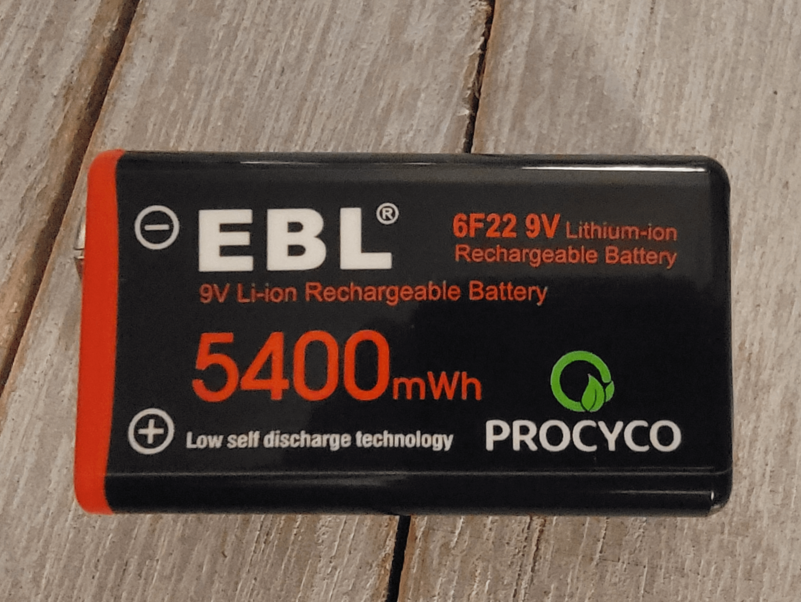

My son is three years old and wants to be a firetruck for Halloween—no, not a firefighter, a firetruck! Luckily, Spirit Halloween has a [firetruck costume](https://www.spirithalloween.com/product/toddler-light-up-firetruck-ride-along-costume/162676.uts) that even lights up. However, it doesn't have a siren, which would obviously be the best part of the costume! Do not worry; I did what any dad would do: I made a siren with a little circuitry and a 3D-printed enclosure.

This post is mainly to remind my future self how it all came together, but maybe you'll find it helpful!

## The Parts

Below is the Bill of Material (BOM).

| Item | Description | Link |
|-----|-----|-----|
| Breadboard | MCIGICM 400 Points Solderless Breadboard | [Amazon Link](https://www.amazon.com/dp/B07PCJP9DY) |
| Wires | ELEGOO Breadboard Jumper Ribbon Cables Kit | [Amazon Link](https://www.amazon.com/dp/B01EV70C78) |
| Battery | EBL Rechargeable 9V Lithium Batteries, 5400mWh | [Amazon Link](https://www.amazon.com/dp/B08Z7979WM) |
| Voltage Regulator | LM2596 LM2596S DC-DC Step Down Variable Volt Regulator Input 3.0-40V Output 1.5-35V | [Amazon Link](https://www.amazon.com/dp/B07PDGG84B)
| On/Off Switch | 12V Rocker Switch On/Off 2 Pin 2 Position SPST Toggle Switch | [Amazon Link](https://www.amazon.com/dp/B0CVTRKJTV)
| Volume / Track Switch | 12mm Momentary Push Button Switch PBS-33B-Y-X | [Amazon Link](https://www.amazon.com/dp/B099MZWDR7)
| MP3 Player | DFPlayer Mini MP3 Player Audio Module | [Amazon Link](https://www.amazon.com/dp/B07Y2YKYRS) |
| Speaker | Gikfun 2" 4Ohm 3W Full Range Audio Speaker | [Amazon Link](https://www.amazon.com/dp/B01CHYIU26) |
| Circuit Enclosure | Custom 3D Printed Enclosure | [Printables](https://www.printables.com/model/1051600-400-points-solderless-breadboard-enclosure) |
| Speaker Enclosure | Custom 3D Printed Enclosure | [Printables](https://www.printables.com/model/1051608-speaker-enclosure) |
| 9v Enclosure | Existing 3D Printed Enclosure | [Printables](https://www.printables.com/model/221300-9v-battery-holder/files) |

## Circuit

The circuit is pretty simple. It comprises a 5v MP3 Player, 9v battery, voltage regulator, speaker, and a few switches.

### 1. MP3 Player

The 5v MP3 Player has a mini SD card reader to load MP3s.

The pins used were:

- `VCC`: 5v from the voltage regulator)
- `GND`: both of them
- `SPK_1`: Positive speaker terminal
- `SPK_2`: Negative speaker terminal
- `IO_1`: Play previous / decrease volume
- `IO_2`: Play next / increase volume

### 2. 9V Battery 

A 9V battery provides power to the circuit. I purchased rechargeable 9V batteries. Yes, that's apparently a thing!

### 3. Voltage Regulator

The voltage regulator is to step down the voltage from 9v to 5v, the required voltage for the MP3 player. You could do something simpler, like a voltage divider, but it would be less efficient.

The input is the 9v from the battery, the output is an adjustable voltage. Using a screwdriver you can adjust it to 5v. As mentioned, this 5v output goes to `VCC` of the MP3 player.

### 4. Speaker

The MP3 player can provide up to 3W of power to a speaker without an additional amplifier. For simplicity, I got a 3W speaker. This is connected to `SPK_1` and `SPK_2` on the MP3 player.

### 5. Switches

The switches are to turn it on/off, change the track, or change the volume.

- On/Off rocker switch is connected between the battery and the voltage regulator.
- The momentary switches were connected to `IO_1` and `IO_2` on the MP3 player.

## Siren Noises

The sounds I got were from [pixabay](https://pixabay.com/). These included sirens, trucks backing up, diesel engines, and alarms.

I used [Audacity](https://www.audacityteam.org/) to combine a few to make a longer track. If it was too short, my son spent most of this time going to the next track. About five minutes worth of audio was perfect.

## 3D Enclosure

Three models are used: one for the circuit, one for the speaker, and one for the 9v battery. Below, you can find the three models I used. I made two of them using [Sketchup](https://app.sketchup.com/app) and one I found on [printables](https://www.printables.com).

Our 3D printer is the [Bambu Lab P1P](https://us.store.bambulab.com/collections/3d-printer/products/p1p). It printed all of the enclosures without issues.

### Circuit Enclosure

The first enclosure is for the circuit. It uses an interference fit for the lid (uses friction to hold it shut).
[Circuit Enclosure Model](https://www.printables.com/model/1051600-400-points-solderless-breadboard-enclosure)

### Speaker Enclosure

The second enclosure is for the speaker. It also uses an interference fit.
[Speaker Enclosure Model](https://www.printables.com/model/1051608-speaker-enclosure)

### Battery Holder

There were already plenty of designs for 9v batteries. This one worked best for me:
[9v Battery Holder Model](https://www.printables.com/model/221300-9v-battery-holder/files)

## Final Product

The final product could have been better. My day job is in software, where you can have quick feedback and iteration cycles. These cycles are much slower when dealing with hardware. Nevertheless, don't let perfect be the enemy of good. My son LOVED the siren. He proudly showed it off to whomever he could.

## Improvements

If I were to make this again, I'd try to change the following:

- It's bulky. It made the costume front-heavy. I'd minimize size and weight.
- Better attachment. I used Velcro 3M strips to hold it to the costume. Thus far, it's holding up, but it likely won't last long.

- The on/off switch on the circuit enclosure's cover was not needed. I'd move it to the side. This was an unnecessary failure point.
- 9v couldn't always handle the demands of the circuit and speaker. During loud sounds, the voltage would drop from 9v to 4v. A different power supply or fancier circuitry would likely fix that.
